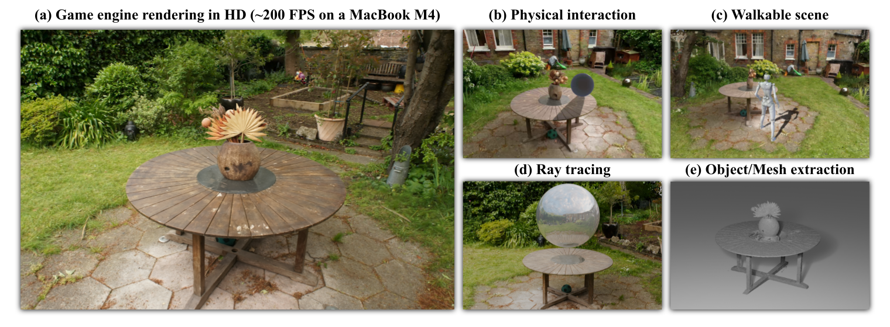

<h1 align="center">MeshSplatting: Differentiable Rendering with Opaque Meshes</h1>
<p align="center">
  Jan Held, Sanghyun Son, Renaud Vandeghen, Daniel Rebain, Matheus Gadelha, Yi Zhou, Anthony Cioppa, Ming C. Lin, Marc Van Droogenbroeck, Andrea Tagliasacchi
</p>

<div align="center">
  <a href="https://meshsplatting.github.io">Project page</a> &nbsp;|&nbsp;
  <a href="https://arxiv.org/abs/2512.06818">ArXiv</a>
  <br>
</div>

<br>

<div align="center">
🚀 Real-time viewer coming soon, stay tuned 🚀
</div>

<br>

<div align="center">
  
</div>

⭐️ This repo contains the official implementation for the paper "MeshSplatting: Differentiable Rendering with Opaque Meshes". ⭐️


## Cloning the Repository + Installation

The code has been used and tested with Python 3.11 and CUDA 12.6.

You should clone the repository with the different submodules by running the following command:

```bash
git clone https://github.com/meshsplatting/mesh-splatting --recursive
cd mesh-splatting
```

Then, we suggest to use a virtual environment to install the dependencies.

```bash
micromamba create -n mesh_splatting python=3.11
micromamba activate mesh_splatting
micromamba install nvidia/label/cuda-12.6.0::cuda

pip install torch==2.7.1 torchvision==0.22.1
pip install -r requirements.txt
```

Finally, you can compile the custom CUDA kernels by running the following command:

```bash
bash compile.sh
cd submodules/simple-knn
pip install . --no-build-isolation
cd submodules/effrdel
pip install -e .
```

[Optional] We integrated the drop-in replacements from [Taming-3dgs](https://humansensinglab.github.io/taming-3dgs/)<sup>1</sup> with [fused ssim](https://github.com/rahul-goel/fused-ssim/tree/main) into the original codebase to speed up training times. To install fused_ssim. you just have to install:
```
# Install from GitHub (recommended)
pip install git+https://github.com/rahul-goel/fused-ssim/ --no-build-isolation

# Or clone and install locally
git clone https://github.com/rahul-goel/fused-ssim.git
cd fused-ssim
pip install . --no-build-isolation
```
The codebase will automatically switch to fused_ssim after installation.

## Training
To train our model, you can use the following command:
```bash
python train.py -s <path_to_scenes> -m <output_model_path> --eval
```

If you want to train the model on indoor scenes, you should add the following command:  
```bash
python train.py -s <path_to_scenes> -m <output_model_path> --indoor --eval
```

## Full evaluation on MipNeRF-360
To run the full evaluation on MipNeRF-360, you can use the following command:
```bash
bash bash_scripts/run_all.sh <path_to_save>
```
Note that this command assumes you are using a machine with slurm.
Alternatively, you can run the full evaluation without slurm by using the following command:
```bash
python full_eval.py --mipnerf360 <path_to_mipnerf360> --output_path <path_to_save>
```

### Normal supervision
If you want to use supervised normals, you must first extract them:

```bash
python extract_normals.py -s <path_to_dataset>
```
If your dataset uses a different image resolution (e.g., images_2 or images_4), specify it with -i. 
More information can be found under [the following link](https://github.com/YvanYin/Metric3D). You can also use any other normal estimator.

### Depth supervision
To have better reconstructed scenes we use depth maps as priors during optimization with each input images.
For real world datasets depth maps should be generated for each input images, to generate them please do the following:

1. Clone [Depth Anything v2](https://github.com/DepthAnything/Depth-Anything-V2?tab=readme-ov-file#usage):
    ```
    git clone https://github.com/DepthAnything/Depth-Anything-V2.git
    ```
2. Download weights from [Depth-Anything-V2-Large](https://huggingface.co/depth-anything/Depth-Anything-V2-Large/resolve/main/depth_anything_v2_vitl.pth?download=true) and place it under `Depth-Anything-V2/checkpoints/`
3. Generate depth maps:
   ```
   python Depth-Anything-V2/run.py --encoder vitl --pred-only --grayscale --img-path <path to input images> --outdir <output path>
   ```
   Create a folder named 'depth' to store the depth maps. This folder should be placed alongside the folders containing the RGB images, for example: MipNeRF360/Garden/depth.
5. Generate a `depth_params.json` file using:
    ```
    python utils/make_depth_scale.py --base_dir <path to colmap> --depths_dir <path to generated depths>
    ```

 The depth regularization we integrated is that used in our [Hierarchical 3DGS](https://repo-sam.inria.fr/fungraph/hierarchical-3d-gaussians/) pape.


## Rendering
To render a scene, you can use the following command:
```bash
python render.py -m <path_to_model>
```

To create a video, you can use the following command:
```bash
python create_video.py -m <path_to_model> -s <path_to_scenes>
```

## Create custom PLY files of optimized scenes

To save your optimized scene after training, just run:

```
python create_ply.py <output_model_path>
```

## Download optimized ply files (+-100MB)

If you want to run some scene on a game engine for yourself, you can download the <em>Garden</em> and <em>Room</em> scenes from the following <a href="https://drive.google.com/drive/folders/1fHMm1-asUx8pJbKZC_3jHhBx5ZMoTDP3" target="_blank">link</a>.
To achieve the highest visual quality, you should use 4× supersampling.
Note that all PLY files store only RGB colors, which on average leads to a 2 dB drop in PSNR. For the highest visual quality, please refer to our viewer.

## Download the Unity project to explore physics-based interactions and walkable scenes

If you want to try out physics interactions or explore the environment with a character, you can download the Unity project from the link below: <a href="https://drive.google.com/drive/folders/12WHLj4nkdzafMsGnm7Otj58iWXYRQyKm?usp=sharing">link</a>. To achieve the highest visual quality, you should use 4× supersampling.
Note that all PLY files store only RGB colors, which on average leads to a 2 dB drop in PSNR. For the highest visual quality, please refer to our viewer.

## Object Extraction
First, you need to create a mask of the objects you want to extract. 
We created a lightweight utiliy script to create a json file for a given image.
```bash
python annotate_points_boxes.py <Image.png>
```

This code relies on [Segment Anything Model 2 (SAM)](https://github.com/facebookresearch/sam2). You can follow the instructions in the repository to install it, or run the following command to install it automatically:
```bash
pip install 'git+https://github.com/facebookresearch/sam2.git'
```

Run the following command to get the model weights:
```
./checkpoints/download_ckpts.sh 
```

To extract only the triangles corresponding to a specific object, run the following commands:

```
1. python -m segmentation.extract_images -s <path_to_scenes> -m <path_to_model> --eval 
2. python -m segmentation.sam_mask_generator_json --data_path <path_to_images> --save_path <path_to_save_masks> --json_path <path_to_json_file>
3. python -m segmentation.segment -s <path_to_scenes> -m <path_to_model> --eval --path_mask <path_to_masks> --object_id <object_id>
4. python -m segmentation.run_single_object -s <path_to_scenes> -m <path_to_model> --eval --ratio_threshold 0.90
5. python -m segmentation.create_ply <path_to_model>
```

The --ratio_threshold parameter controls how confidently triangles are considered part of the object. Higher values render only triangles that are very likely to belong to the object, while lower values are recommended for object removal and higher values for object extraction.

1. Extracts the training views used for segmentation.  
2. Runs SAM on each view to generate object masks.  
3. Identifying which triangles belong to the selected object.  
4. Loads and renders only the triangles belonging to the object on the training views.  
5. Saves the extracted triangles as PLY file.


## Related Work

Check out related work that led to our project:

- **[Triangle Splatting for Real-Time Radiance Field Rendering](https://trianglesplatting.github.io/)**
- **[3D Convex Splatting: Radiance Field Rendering with 3D Smooth Convexes](https://convexsplatting.github.io/)**
- **[DMesh++: An Efficient Differentiable Mesh for Complex Shapes](https://sonsang.github.io/dmesh2-project/)**
- **[DMesh: A Differentiable Mesh Representation](https://sonsang.github.io/dmesh-project/)**
- **[MiLo: Mesh-In-the-Loop Gaussian Splatting for Detailed and Efficient Surface Reconstruction](https://anttwo.github.io/milo/)**


## BibTeX
If you find our work interesting or use any part of it, please cite our paper:
```bibtex
@article{Held2025MeshSplatting,
title = {MeshSplatting: Differentiable Rendering with Opaque Meshes},
author = {Held, Jan and Son, Sanghyun and Vandeghen, Renaud and Rebain, Daniel and Gadelha, Matheus and Zhou, Yi and Cioppa, Anthony and G Lin, Ming C. and Van Droogenbroeck, Marc and Tagliasacchi, Andrea},
journal = {arXiv},
year = {2025}
}
```

And related work that strongly motivated and inspired MeshSplatting:

```bibtex
@article{Held2025Triangle,
title = {Triangle Splatting for Real-Time Radiance Field Rendering},
author = {Held, Jan and Vandeghen, Renaud and Deliege, Adrien and Hamdi, Abdullah and Cioppa, Anthony and Giancola, Silvio and Vedaldi, Andrea and Ghanem, Bernard and Tagliasacchi, Andrea and Van Droogenbroeck, Marc},
journal = {arXiv},
year = {2025},
}
```

```bibtex
@InProceedings{held20243d,
title={3D Convex Splatting: Radiance Field Rendering with 3D Smooth Convexes},
  author={Held, Jan and Vandeghen, Renaud and Hamdi, Abdullah and Deliege, Adrien and Cioppa, Anthony and Giancola, Silvio and Vedaldi, Andrea and Ghanem, Bernard and Van Droogenbroeck, Marc},
  booktitle = {Proceedings of the IEEE/CVF Conference on Computer Vision and Pattern Recognition (CVPR)},
  year = {2025},
}
```

## Acknowledgements
J. Held is funded by the F.R.S.-FNRS. The present research benefited from computational resources made available on Lucia, the Tier-1 supercomputer of the Walloon Region, infrastructure funded by the Walloon Region under the grant agreement n°1910247.

Finally, we thank Bernhard Kerbl and George Kopanas for their helpful feedback and for proofreading the paper.
